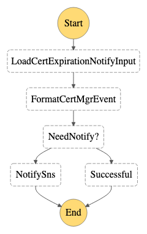

# Send notifications when certicates in ACM is to expire

State machine to process Cloudwatch alarms and send notifications to operators.



* Following command are for AWSCLIv2, if you are using v1, please remove the --no-cli-pager option.

## Deploy 

``` bash
MAIN_REGION=<main region>
SNS_TOPIC_ARN=$(aws cloudformation describe-stacks --stack-name AutoOpsCommon --region $MAIN_REGION --no-cli-pager --query 'Stacks[0].Outputs[?OutputKey==`SNSTopic`].OutputValue' --output text)
cd ~/AutoOps/CertExpirationNotify
REGION=<region>
sam build
sam deploy --stack-name AutoOpsCertExpirationNotify --region $REGION --parameter-overrides SnsTopicArn=$SNS_TOPIC_ARN --confirm-changeset --resolve-s3 --capabilities CAPABILITY_IAM
```

## Start

``` bash
STATE_MACHINE_ARN=$(aws cloudformation describe-stacks --stack-name AutoOpsCertExpirationNotify --region $REGION --no-cli-pager --query 'Stacks[0].Outputs[?OutputKey==`CertExpirationNotifyStateMachine`].OutputValue' --output text)
aws stepfunctions start-execution --state-machine-arn $STATE_MACHINE_ARN --input file://examples/to_exprire_example.json --region $REGION --no-cli-pager
```
