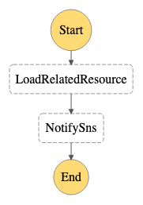

# Send notifications when certicates in ACM is to expire

State machine to process Cloudwatch alarms and send notifications to operators.



**Commands in this document are for [AWSCLIv2](https://docs.aws.amazon.com/cli/latest/userguide/getting-started-install.html) and [SAM](https://docs.aws.amazon.com/serverless-application-model/latest/developerguide/install-sam-cli.html). You can excecute them in [CloudShell](https://console.aws.amazon.com/cloudshell), in which these tools have been installed.**

## Install 

``` bash
git clone https://github.com/lprincewhn/AutoOps.git
cd AutoOps/CertExpirationNotify
AUTO_OPS_TOPIC=<SNS topic receive AutoOps notification> # Messages of this topic will be sent by StepFunction or Lambda, should be in the home region
AWS_REGION=<region>
STACK_NAME="AutoOps$(basename $(pwd))"
sam build
sam deploy --stack-name $STACK_NAME --region $AWS_REGION --parameter-overrides SnsTopicArn=$AUTO_OPS_TOPIC --confirm-changeset --resolve-s3 --capabilities CAPABILITY_IAM
```

## Run with simulated input

``` bash
STATE_MACHINE_ARN=$(aws cloudformation describe-stacks --stack-name $STACK_NAME --region $AWS_REGION --no-cli-pager --query 'Stacks[0].Outputs[?OutputKey==`CertExpirationNotifyStateMachine`].OutputValue' --output text)
EXECUTION_ARN=$(aws stepfunctions start-execution --state-machine-arn $STATE_MACHINE_ARN --input file://examples/to_exprire_example.json --region $AWS_REGION --query 'executionArn' --output text --no-cli-pager)
echo $EXECUTION_ARN
```

## Check the execution

``` bash
aws stepfunctions describe-execution --execution-arn $EXECUTION_ARN --region $AWS_REGION --no-cli-pager
```

## Uninsatll
``` bash
aws cloudformation delete-stack --stack-name $STACK_NAME --region $AWS_REGION --no-cli-pager
```
