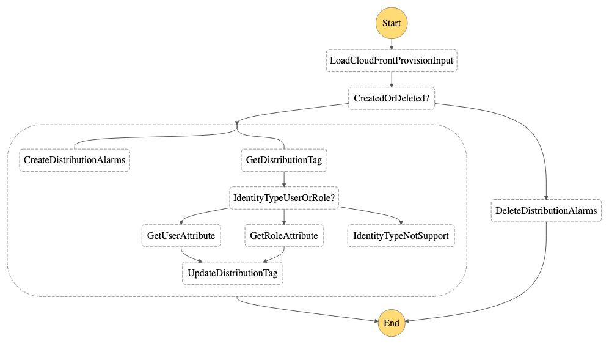

# CloudFront Provision

- State machine to create/delete alarms for CloudFront distributions when they are started/terminated.

    

## Install 

```
# cd ~/AutoOps/CloudFrontProvision
# REGION=<region>
# cp -p workflows/state.asl.all.json state.asl.json
# sam build
# sam deploy --stack-name AutoOpsCloudFrontProvision --region $REGION --confirm-changeset --resolve-s3 --capabilities CAPABILITY_IAM
```

## Start

```
# STATE_MACHINE_ARN=$(aws cloudformation describe-stacks --stack-name AutoOpsCloudFrontProvision --region us-east-1 --no-cli-pager --query 'Stacks[0].Outputs[?OutputKey==`CloudFrontProvisionStateMachine`].OutputValue' --output text)
# aws stepfunctions start-execution --state-machine-arn $STATE_MACHINE_ARN --input file://./examples/example_create_distribution.json  --region $REGION --no-cli-pager
```

## Uninstall

```
# aws cloudformation delete-stack --stack-name AutoOpsCloudFrontProvision --region $REGION --no-cli-pager
```
