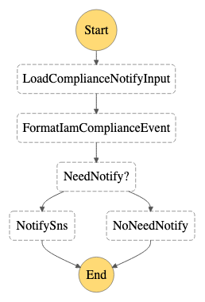

# Process non-compliant resource in AWS Config and send notifications

State machine to process non-compliant resource in AWS Config and send notifications to operators.



* Following aws commands are for AWSCLIv2, if you are using v1, please remove the --no-cli-pager option.

## Deploy 

```
# MAIN_REGION=<main region>
# SNS_TOPIC_ARN=$(aws cloudformation describe-stacks --stack-name AutoOpsCommon --region $MAIN_REGION --no-cli-pager --query 'Stacks[0].Outputs[?OutputKey==`SNSTopic`].OutputValue' --output text)
# cd ~/AutoOps/ComplianceProcessor
# REGION=<region>
# sam build
# sam deploy --stack-name AutoOpsComplianceProcessor --region $REGION --parameter-overrides SnsTopicArn=$SNS_TOPIC_ARN --confirm-changeset --resolve-s3 --capabilities CAPABILITY_IAM
```

## Config

Set value of following parameters according your requirement:

1. Environment variables of FormatIamComplianceEventFunction
- RECEIVER: A Identifier which will be put in SNS message attribute, and user can subscribe SNS topic with this identifier to receive some notifications.


## Start

```
# STATE_MACHINE_ARN=$(aws cloudformation describe-stacks --stack-name AutoOpsComplianceProcessor --region us-east-1 --no-cli-pager --query 'Stacks[0].Outputs[?OutputKey==`ComplianceProcessor`].OutputValue' --output text)
# aws stepfunctions start-execution --state-machine-arn $STATE_MACHINE_ARN --input file://./examples/example.json --region $REGION --no-cli-pager
```

## Uninstall

```
# aws cloudformation delete-stack --stack-name AutoOpsComplianceProcessor --region $REGION --no-cli-pager
```
