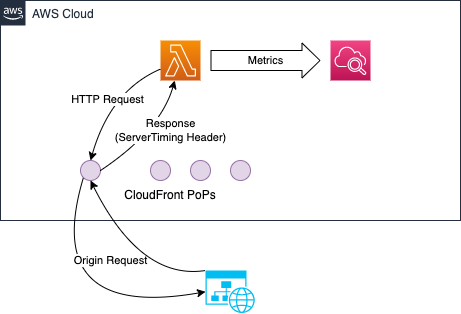

# Use CloudFront ServerTiming Header to do dail test to HTTP server.



Refer to: https://catalog.us-east-1.prod.workshops.aws/workshops/bd5c4657-f985-4568-8135-56149e78e0d6/en-US/60-customized/20-dialtest

* Following command are for AWSCLIv2, if you are using v1, please remove the --no-cli-pager option.

## Deploy 

``` bash
cd ~/AutoOps/DialTest
REGION=<region>
DialTarget=<domain name of dial target>
DialUri=<uri start with / to check>
sam build
sam deploy --stack-name AutoOpsDialTest --region $REGION --parameter-overrides CloudFrontServiceTimingPolicyId=$CloudFrontServiceTimingPolicyId DialTarget=$DialTarget DialUri=$DialUri --confirm-changeset --resolve-s3 --capabilities CAPABILITY_IAM
```

