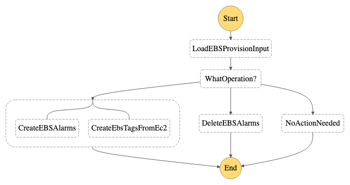

# EC2 Provision

- State machine to create/delete alarms and EBS tags for EBS volume when they are attached/detached to/from EC2 instance.
    

## Prerequisite

This state machine was triggered by CloudTrail events so you need to create a trail to enable the event.

[https://console.aws.amazon.com/cloudtrail/home](https://console.aws.amazon.com/cloudtrail/home)

## Install 

```
MAIN_REGION=<main region>
SNS_TOPIC_ARN=$(aws cloudformation describe-stacks --stack-name AutoOpsCommon --region $MAIN_REGION --no-cli-pager --query 'Stacks[0].Outputs[?OutputKey==`SNSTopic`].OutputValue' --output text)
cd ~/AutoOps/EBSProvision
REGION=<region>
sam build
sam deploy --stack-name AutoOpsEBSProvision --region $REGION --confirm-changeset --resolve-s3 --capabilities CAPABILITY_IAM
```

## Start

```
STATE_MACHINE_ARN=$(aws cloudformation describe-stacks --stack-name AutoOpsEBSProvision --region $REGION --no-cli-pager --query 'Stacks[0].Outputs[?OutputKey==`EBSProvisionStateMachine`].OutputValue' --output text)
aws stepfunctions start-execution --state-machine-arn $STATE_MACHINE_ARN --input file://examples/example_ebs_attached.json --region $REGION --no-cli-pager
```

## Uninstall

```
aws cloudformation delete-stack --stack-name AutoOpsEBSProvision --region $REGION --no-cli-pager
```
