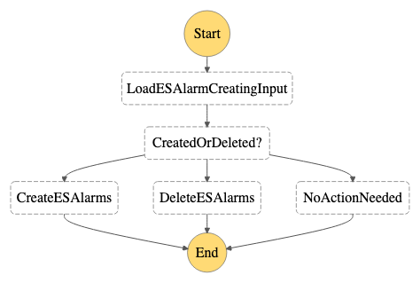

# Deploy CloudWatch alarms for AWS Elasticsearch domain

- State machine to create/delete alarms for AWS Elasticsearch domains when they was created/deleted.

    

## Prerequisite

This state machine was triggered by CloudTrail events so you need to create a trail to enable the event.

[https://console.aws.amazon.com/cloudtrail/home](https://console.aws.amazon.com/cloudtrail/home)

* Following command are for AWSCLIv2, if you are using v1, please remove the --no-cli-pager option.

## Deploy 

```
# MAIN_REGION=<main region>
# SNS_TOPIC_ARN=$(aws cloudformation describe-stacks --stack-name AutoOpsCommon --region $MAIN_REGION --no-cli-pager --query 'Stacks[0].Outputs[?OutputKey==`SNSTopic`].OutputValue' --output text)
# cd ~/AutoOps/ESProvision
# REGION=<region>
# sam build
# sam deploy --stack-name AutoOpsESProvision --region $REGION --confirm-changeset --resolve-s3 --capabilities CAPABILITY_IAM
```

## Start

```
# STATE_MACHINE_ARN=$(aws cloudformation describe-stacks --stack-name AutoOpsESProvision --region us-east-1 --no-cli-pager --query 'Stacks[0].Outputs[?OutputKey==`ESProvisionStateMachine`].OutputValue' --output text)
# aws stepfunctions start-execution --state-machine-arn $STATE_MACHINE_ARN --input file://./examples/example_create.json  --region $REGION --no-cli-pager
```
