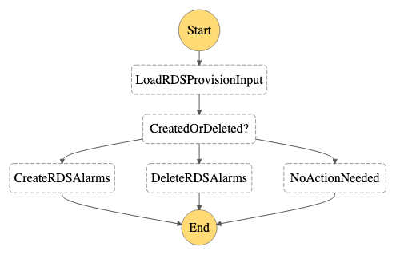

# RDS Provision

- State machine to create/delete alarms for RDS database nodes when they are started/terminated.

    

## Deploy 

```
# MAIN_REGION=<main region>
# SNS_TOPIC_ARN=$(aws cloudformation describe-stacks --stack-name AutoOpsCommon --region $MAIN_REGION --no-cli-pager --query 'Stacks[0].Outputs[?OutputKey==`SNSTopic`].OutputValue' --output text)
# cd ~/AutoOps/RDSProvision
# REGION=<region>
# sam build
# sam deploy --stack-name AutoOpsRDSProvision --region $REGION --parameter-overrides SnsTopicArn=$SNS_TOPIC_ARN --confirm-changeset --resolve-s3 --capabilities CAPABILITY_IAM
```

## Start

```
# STATE_MACHINE_ARN=$(aws cloudformation describe-stacks --stack-name AutoOpsRDSProvision --region $REGION --no-cli-pager --query 'Stacks[0].Outputs[?OutputKey==`RDSProvisionStateMachine`].OutputValue' --output text)
# aws stepfunctions start-execution --state-machine-arn $STATE_MACHINE_ARN --input file://./examples/example_create_rds.json  --region $REGION --no-cli-pager
```
