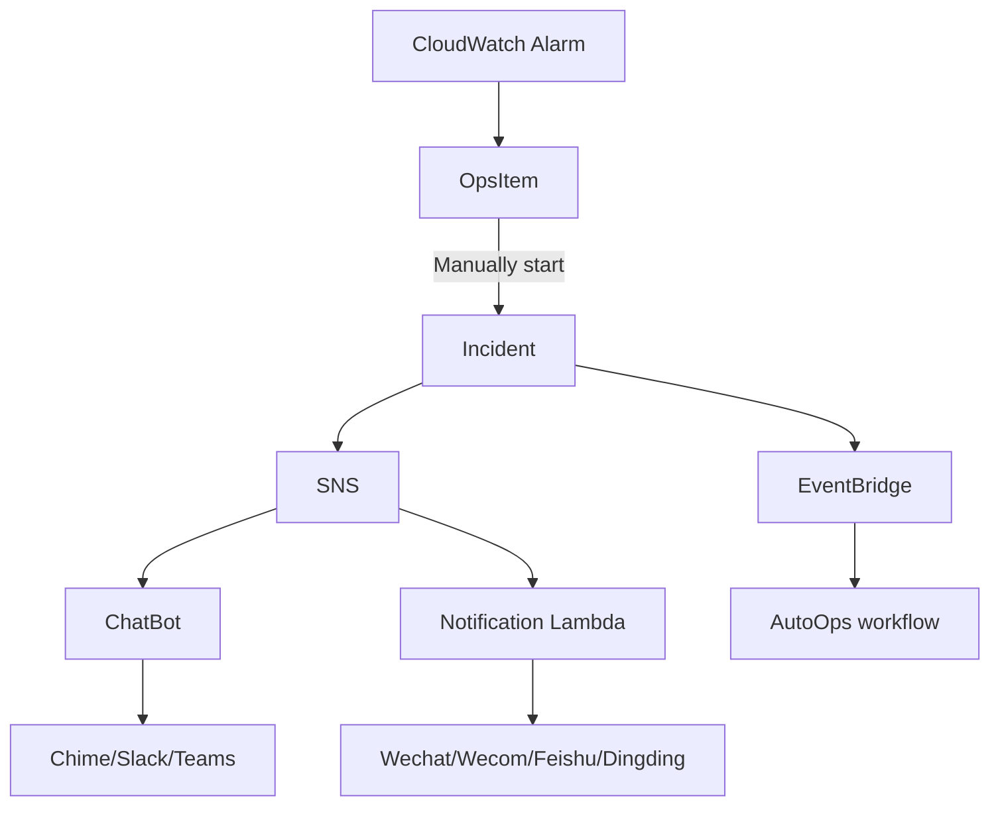
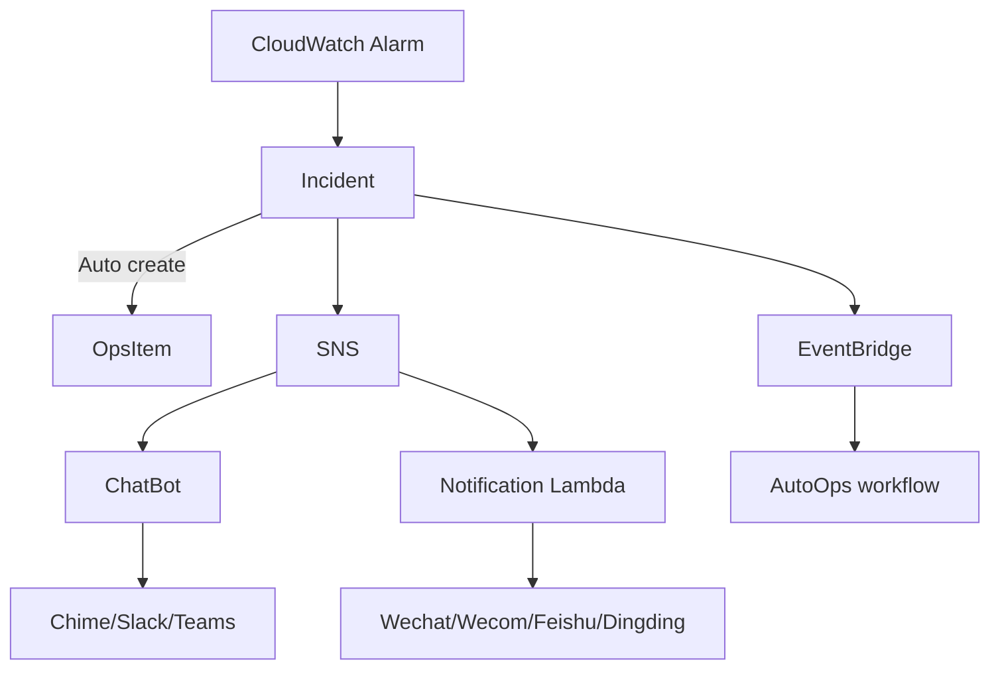

# AutoOps

This project contains useful operational processes represented as state machines with AWS StepFunctions. 






## How to deploy

You can pickup one region to deploy SNS topic 

1. Start CloudShell and clone this project

    ![https://console.aws.amazon.com/cloudshell/home]

    ```
    # cd ~
    # git clone https://github.com/lprincewhn/AutoOps.git
    ```

2. Pick up a main region to deploy a common SNS topic where notifications will be sent to, or you can use an SNS topic existed by setting it in environment variable $SNS_TOPIC_ARN.
   
    ```
    # MAIN_REGION=<main region>
    # ACCOUNT=$(aws sts get-caller-identity --query 'Account' --output text)
    # cd ~/AutoOps/Common/
    # sam build
    # sam deploy --stack-name AutoOpsCommon --region $MAIN_REGION --confirm-changeset --resolve-s3 --capabilities CAPABILITY_IAM
    # SNS_TOPIC_ARN="arn:aws:sns:${MAIN_REGION}:${ACCOUNT}:AutoOps"
    # aws sns subscribe --topic-arn ${SNS_TOPIC_ARN}" --protocol email --notification-endpoint <yourmail@corp.com> 
    ```

3. Go into sub-directory of each process to continue.

- [AlarmProcessor](AlarmProcessor): Process CloudWatch alarms and send notifications
- [PhdEventProcessor](PhdEventProcessor): Process PHD events and send notifications
- [ComplianceProcessor](ComplianceProcessor): Process non-compliant resource in AWS Config and send notifications
- [EC2Provision](EC2Provision): Create/Delete alarms for EC2 instances when they are started/terminated
- [RDSProvision](RDSProvision): Create/Delete alarms for RDS database nodes when they are started/terminated
- [ESProvision](ESProvision): Deploy CloudWatch alarms for AWS Elasticsearch domain
- [CloudFrontProvision](CloudFrontProvision): Deploy CloudWatch alarms and update tags for AWS CloudFront distribution
- [RedshiftAuditLogToES](RedshiftAuditLogToES): Transform and deliver Redshift audit logs in S3 bucket to Amazon ElasticSearch service
- [VisualizeCloudFrontLog](VisualizeCloudFrontLog): Transform and deliver CloudFront standard logs in S3 bucket to CloudWatch or OpenSearch service
- [TagCompliance](TagCompliance): Check tags of EC2 periodly and notify users when tags are not compliant
- [MergeMetricData](MergeMetricData): Merge CloudWatch metric data to to centralized S3 bucket
- [SecurityHarden](SecurityHarden): Harden security by AWS Guardduty

## How to try

The state machines, who represent operational processes, should be triggered by CloudWatch events (for AWS resource). You can use awscli command to start state machines' execution mannully.

