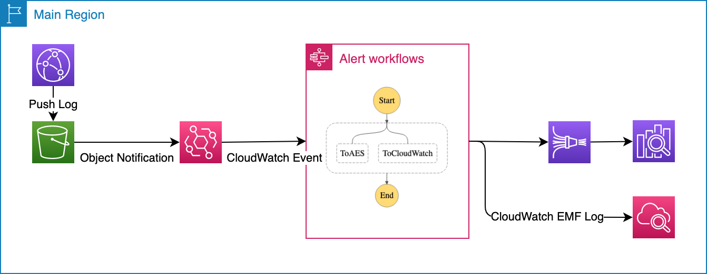

# Transform and deliver CloudFront standard logs in S3 bucket to Cloudwatch or Amazon OpenSearch service.



* Following command are for AWSCLIv2, if you are using v1, please remove the --no-cli-pager option.

## Deploy 

1. Deploy with SAM CLI

``` bash
cd ~/AutoOps/VisualizeCloudFrontLog
REGION=<region>
DestinationESArn=<ARN of AES domain>
S3BackupBucket=<S3 bucket for backup>
sam build
sam deploy --stack-name AutoOpsCloudFrontLog --region $REGION --parameter-overrides DestinationESArn=$DestinationESArn S3BackupBucket=$DestinationBucket --confirm-changeset --resolve-s3 --capabilities CAPABILITY_IAM
```

2. Conifg your CloudFront Distribution or S3 Bucket replication to store file in SOURCE_BUCKET


3. Map role FirehoseRole in AES if finegrained access control is enabled.
