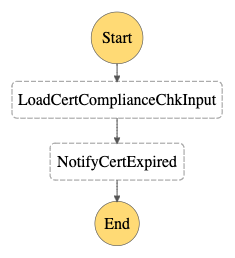

# ACM certificate expire notification

- State machine to check compliance of ACM certificates and it will send SNS notification when found a certificate is to expire.

    

## Prerequisites

The AWS Config rule to check compliance of ACM certificates should be deployed with CloudFormation. Please refer to [https://docs.aws.amazon.com/zh_cn/config/latest/developerguide/acm-certificate-expiration-check.html]

## Testing

1. ACM certificate expire notification

    ```
    # curl <APIGateway Endpoint>/cert-expire -X POST -d '{"input": "{\"version\": \"0\",\"id\": \"9c95e8e4-96a4-ef3f-b739-b6aa5b193afb\",\"detail-type\": \"ACM Certificate Approaching Expiration\",\"source\": \"aws.acm\",\"account\": \"123456789012\",\"time\": \"2020-09-30T06:51:08Z\",\"region\": \"us-east-1\",\"resources\": [\"arn:aws:acm:us-east-1:123456789012:certificate/61f50cd4-45b9-4259-b049-d0a53682fa4b\",\"arn:aws:acm:us-east-1:123456789012:certificate/61f50cd4-45b9-4259-b049-d0a53682fa4b\"],\"detail\": {\"DaysToExpiry\": 31,\"CommonName\": \"Aperture Science Portal Certificate Authority - R4\"}}","stateMachineArn":"<CertExpirationChk State Machine ARN>"}'
    ```
