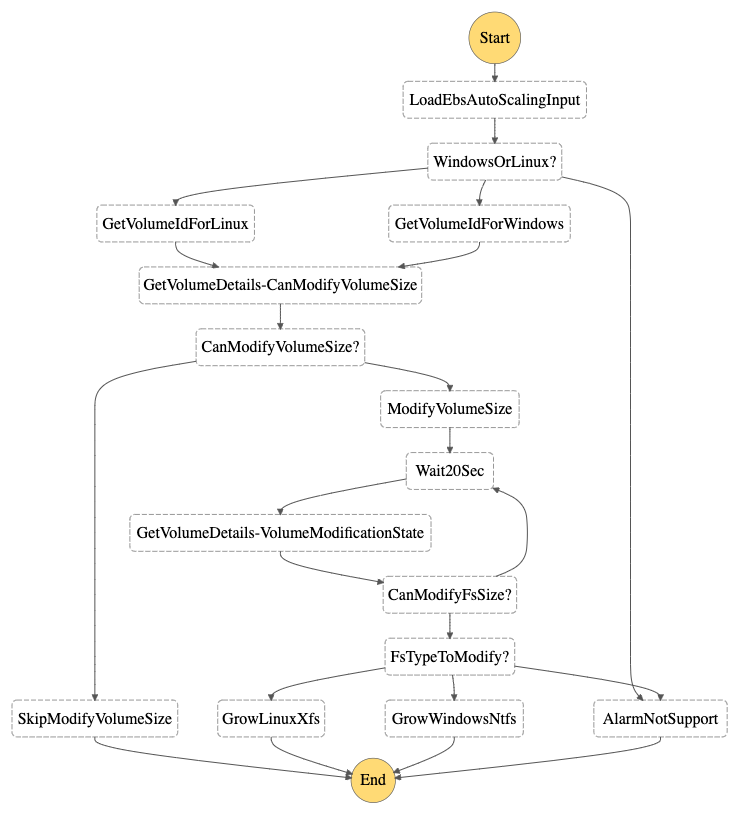
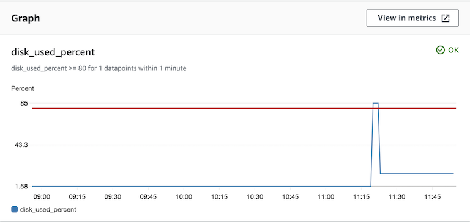
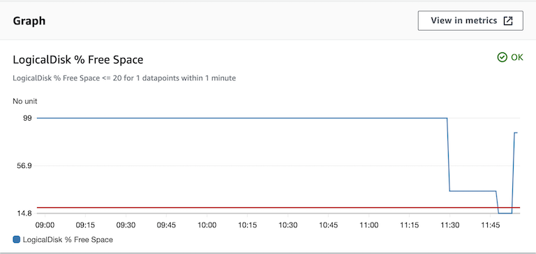

# EBS Auto Scale

- State mechine to scale EBS volume and its file systerm when disk alarm happenes

    

- Result on CentOS:

    

- Result on Windows:

    

This state machine scales up EBS volumes and file systems automatically, which is triggered by EC2 alarms. Since only XFS and NTFS can be scaled up online, if the file systems on your EC2 instances are other than those, please be noted that only the EBS volumes will be scaled up and the Step Functions will stop with error on trying to scale up file systems.

## Prerequisites

    - For running SSM command, you need to install SSM Agent in your EC2 instances. Please refer to [https://docs.aws.amazon.com/systems-manager/latest/userguide/ssm-agent.html]

    - For monitoring the disk usage, you need to install and config CloudWatch agent in your EC2 instances. Please refer to [https://docs.aws.amazon.com/AmazonCloudWatch/latest/monitoring/Install-CloudWatch-Agent.html]

## Testing

1. EBS auto-scaling on Linux

    ```
    # curl <APIGateway Endpoint>/ebs_scale -X POST -d '{"input": "{\"detail-type\": \"CloudWatch Alarm State Change\",\"source\": \"aws.cloudwatch\",\"detail\": {\"alarmName\": \"DiskSpace\",\"state\": {\"value\": \"ALARM\"},\"configuration\": {\"metrics\": [{\"metricStat\": {\"metric\": {\"namespace\": \"CWAgent\",\"name\": \"disk_used_percent\",\"dimensions\": {\"path\": \"<The mount point of device>\",\"InstanceId\": \"<Your EC2 Instance ID for test>\",\"device\": \"<The device name in OS>\",\"fstype\": \"xfs\"}}}}]}}}","stateMachineArn": "<EBS auto-scaling state machine ARN>"}'
    ```

2. EBS auto-scaling on Windows

    ```
    # curl <APIGateway Endpoint>/ebs_scale -X POST -d '{"input": "{\"detail-type\": \"CloudWatch Alarm State Change\",\"source\": \"aws.cloudwatch\",\"detail\": {\"alarmName\": \"DiskSpace\",\"state\": {\"value\": \"ALARM\"},\"configuration\": {\"metrics\": [{\"metricStat\": {\"metric\": {\"namespace\": \"CWAgent\",\"name\": \"LogicalDisk % Free Space\",\"dimensions\": {\"instance\": \"<The Drive Letter>:\",\"InstanceId\": \"<Your EC2 Instance ID for test>\"}}}}]}}}","stateMachineArn": "<EBS auto-scaling state machine ARN>"}'
    ```